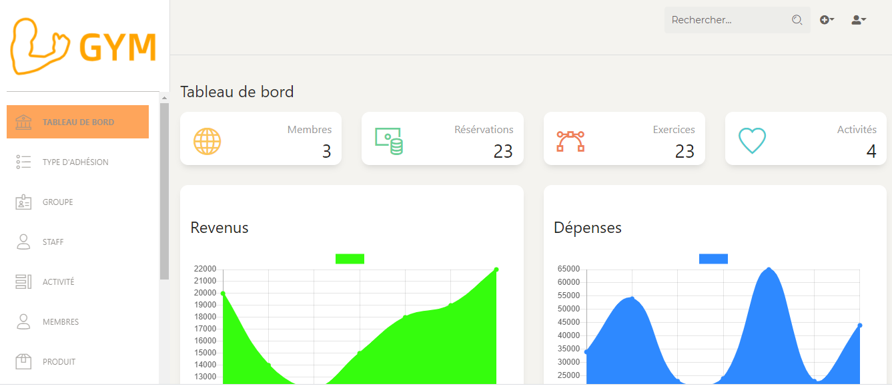

## Introduction

GYM  is an easy-to-use gym management and administration system. It helps you to keep track of the records of your members and their memberships, and allows easy communication between you and your members. Gym Management system also includes additional features that will help you in the management and growth of your club and gym.

## Informations
-  Status: under development
-   Latest version 1.0
-   Sector: service
-   Created: November 2020
-   Last updated: November 2020

## Table of contents
* [Documentation](#general-info)
* [Demo](#demo)
* [Screenshots](#screenshots)
* [Technologies](#technologies)
* [Setup](#setup)
* [Features](#features)
* [Status](#status)
* [Contact](#contact)
* [License](#license)

## Documentation
https://github.com/aniskchaou/GYM-FRONTEND-CLIENT/wiki

## Demo
https://gym-client.herokuapp.com/

## Screenshots

## Technologies
* Spring boot
* Node.js
* React.js

## Setup

## Features
 - Manage customer reservations
 - Manage collective activities
 -  Manage members 
 - Manage the team and staff of physical trainers Manage events

  

## Contact
contact@delta-dev-software.com

## License
<a href="license.txt">MIT License</a>